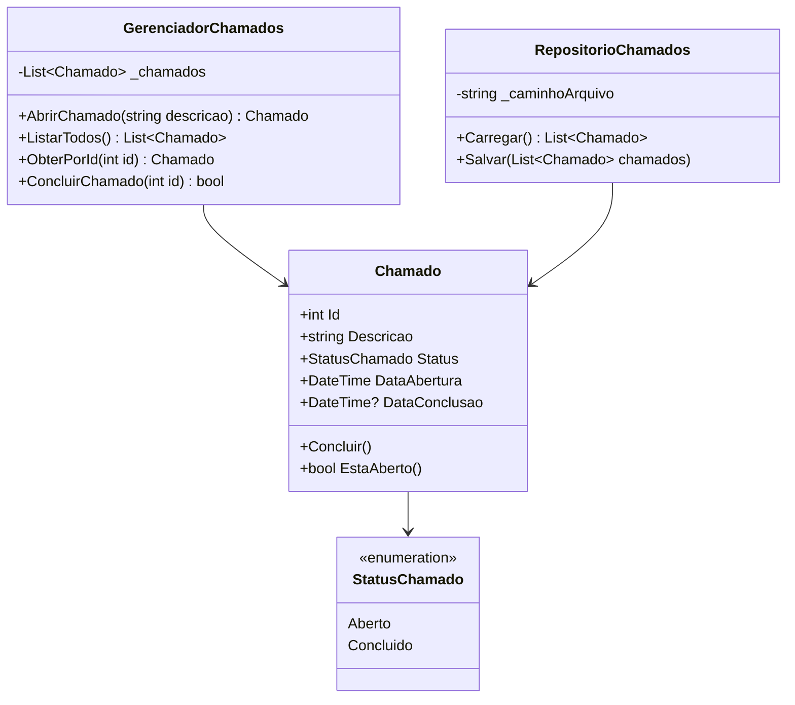


______Gerenciador de Chamados______

Aluna: Maria Luiza Guarese Sasseti

Descrição do Projeto:

- Este projeto foi desenvolvido para a disciplina de Programação Orientada a Objetos I.

- O sistema simula um gerenciador de chamados utilizado por equipes de suporte técnico. Cada chamado possui um identificador único, descrição, status, data de abertura e data de conclusão.

- Nesta versão o projeto implementa as camadas de domínio, persistência em JSON e uma interface de console com menu interativo para criação, consulta e conclusão de chamados.

Diagrama de Classes (Mermaid):

Estrutura do Projeto:

gerenciadorChamados
│
├── Console
│   └── MenuConsole.cs
│
├── Dominio
│   ├── Chamado.cs
   ├── GerenciadorChamados.cs
   └── StatusChamado.cs
│
├── Persistencia
│   └── RepositorioChamados.cs
│
├── chamados.json
├── Program.cs
└── README.md

Funcionalidades Implementadas:
- Abrir novo chamado (menu interativo)
- Gerar ID automático
- Listar chamados registrados
- Buscar chamado por ID e exibir detalhes
- Concluir chamados a partir da tela de detalhes
- Persistência em arquivo JSON (carregar/salvar)
- Carregamento automático dos dados ao iniciar o programa

Decisões de implementação relevantes:
- Propriedades do Chamado possuem setters privados para garantir encapsulamento e evitar alterações diretas ao estado.
- GerenciadorChamados clona a lista recebida no construtor e ListarTodos() retorna uma cópia da coleção para proteger o estado interno.

Como Executar:
- Abrir o projeto no Visual Studio.
- Compilar a solução (.NET 10).
- Executar o projeto.
- Ao executar, será exibido um menu interativo em console. Ao sair pelo menu, os dados são persistidos em chamados.json.

Ou pelo terminal na pasta do projeto:
- dotnet run

Requisitos:
- .NET 10 SDK

Tecnologias Utilizadas:
- C#
- .NET 10
- System.Text.Json
- Programação Orientada a Objetos
